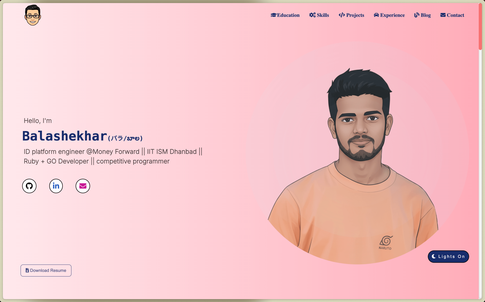

### portfolio

A responsive personal portfolio website built using raw HTML, CSS, and JavaScript that showcases skills, projects, education, and experience in an interactive way.



- Developed during my college days.

### See It Live

<div style="text-align: center; display: flex; align-items: center;">
    <span style="font-size: 32px; margin-right: 8px;">☞</span> 
    <a href="https://balashekhar.me">here</a>
</div>

### note:

**Opening `index.html` directly in a browser won't work properly because:**

1. Modern browsers block local file access due to security restrictions (CORS policy)
2. Features like loading the footer component require proper HTTP protocol
3. A local server better simulates the production environment

Using a local server (like `http-server` or Python's server) serves files over HTTP protocol, which:

- Prevents CORS issues
- Allows JavaScript to fetch local resources
- Matches how the site will run in production

* so use

<details><summary>http-server to run on local</summary>
<p>

```bash
# Install http-server globally
npm install -g http-server

# Start the server
http-server -p 8080

# Then open in your browser
# http://localhost:8080
```

</p>
</details>
